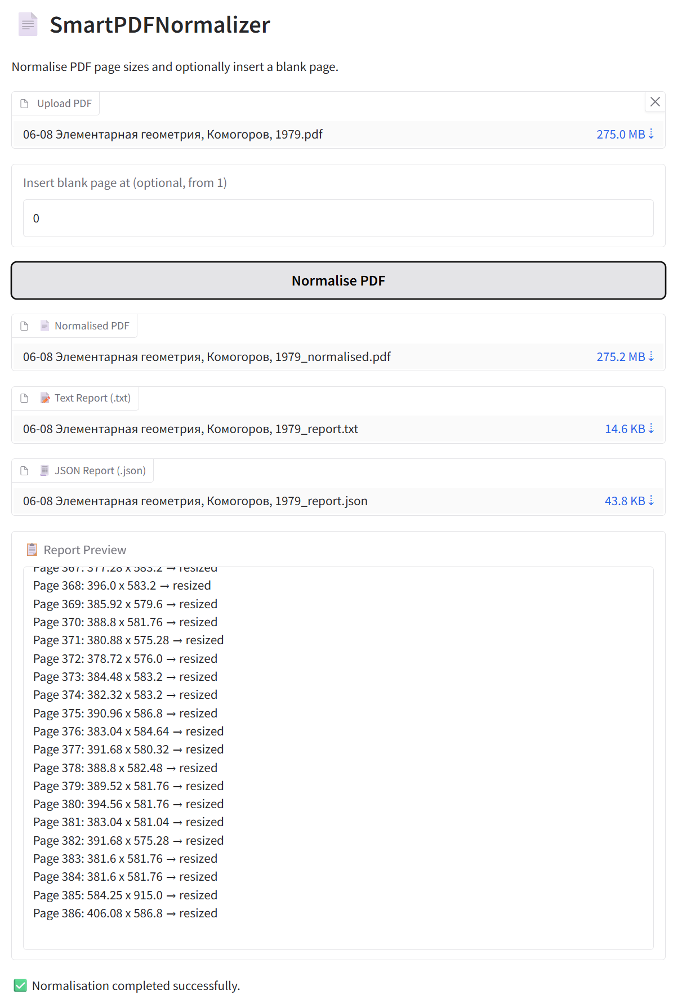

# SmartPDFNormalizer

**SmartPDFNormalizer** is a command-line utility that normalises PDF page sizes to a unified format and optionally inserts a blank page at a specific position.  
It is useful for ensuring consistent display, layout uniformity, or preparing documents for print or automated processing.

---

---

## Features

- Detects the most common page dimensions across the document (mode).
- Calculates the average of similar page sizes (within a tolerance).
- Rescales all pages to the average dimensions.
- Optionally inserts a blank page at a given position.
- Generates a report of all page transformations in both `.txt` and `.json` formats.
- Offers a simple **Gradio-based GUI**.

## Requirements

- Python 3.7+
- [PyMuPDF](https://pymupdf.readthedocs.io/en/latest/) (`pip install pymupdf`)
- [Gradio](https://gradio.app/) for the optional graphical interface (`pip install gradio`)

## Installation

Clone the repository and install the required dependency:

```bash
git clone https://github.com/loglux/SmartPDFNormalizer.git
cd SmartPDFNormalizer
pip install -r requirements.txt
```

`requirements.txt`:
```
pymupdf
gradio
```

## Usage

```bash
python pdf2norm.py input.pdf output.pdf [--insert_blank 3] [--report_txt my_report.txt] [--report_json my_report.json]
```

### Arguments

| Argument           | Description                                                                          |
|--------------------|--------------------------------------------------------------------------------------|
| `input`            | Path to the input PDF file.                                                         |
| `output`           | Path to the output PDF file (after normalisation).                                  |
| `--insert_blank`   | (Optional) 1-based index of where to insert a blank page.                           |
| `--report_txt`     | (Optional) Path to save the human-readable `.txt` report. Default: `report.txt`.    |
| `--report_json`    | (Optional) Path to save the machine-readable `.json` report. Default: `report.json`.|

## Example

```bash
python pdf_norm.py input.pdf output.pdf --insert_blank 3 --report_txt summary.txt --report_json summary.json
```

This command will:
- Calculate the most frequent page size in the input PDF.
- Average the dimensions of similar pages (within 0.15 pt tolerance).
- Resize all pages to that average size.
- Insert a blank page as the new third page.
- Save transformation details to `summary.txt` and `summary.json`.

---
## Usage (GUI)

To launch the graphical interface:

```bash
python gui.py
```

- Upload your PDF.
- Specify the optional blank page position.
- Click **"Normalise PDF"** to generate the output and download files.

The GUI is built with [Gradio](https://gradio.app/) and runs in your browser at `http://127.0.0.1:7860`.
---

## Output

- `output.pdf`: The normalised PDF file.
- `report.txt`: A plain-text summary of page changes.
- `report.json`: A structured report with details for each page.

## Limitations

- The tool currently assumes that most pages are of the desired size and filters out outliers like covers or inserts based on similarity to the mode.
- Pages with drastically different sizes (e.g. scanned covers or inserts) will be forcefully rescaled unless filtered beforehand.

## Design Philosophy

SmartPDFNormalizer was created to solve a practical, real-world problem: long PDFs with inconsistent page sizes that disrupt the reading experience or cause layout issues when printing.

Instead of preserving the exact geometry of each page (which is important in archival contexts), the tool focuses on **visual consistency**. It detects the dominant page size, calculates an average from similar sizes, and resizes the rest — even if it introduces minor aspect ratio changes. This trade-off is intentional, as it results in cleaner, more uniform documents for everyday use.

Another key feature is the **optional insertion of a blank page**. This is not just for appearance — it ensures that pages stay correctly paired in two-page spreads, especially during double-sided printing or digital reading. Without it, one missing page (often a front cover) can throw off the entire sequence.

The goal is usability, not archival fidelity. If your priority is faithful preservation of original page proportions or content zones, cropping tools or layout-aware solutions may be more appropriate.

As a related experiment, I once created [remove_black_borders](https://github.com/loglux/remove_black_borders), a script to crop excess margins (usually black bars) from **images**, mostly screenshots taken from restricted online book viewers. That tool served a different purpose and was built for a different context.

## License

This project is licensed under the MIT Licence. See the [LICENSE](LICENSE) file for details.

## Contributions

Contributions, issues and suggestions are welcome!  
Please fork the repository and open a pull request.
